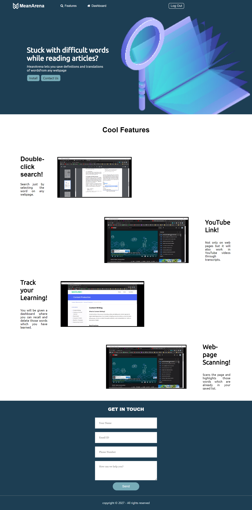
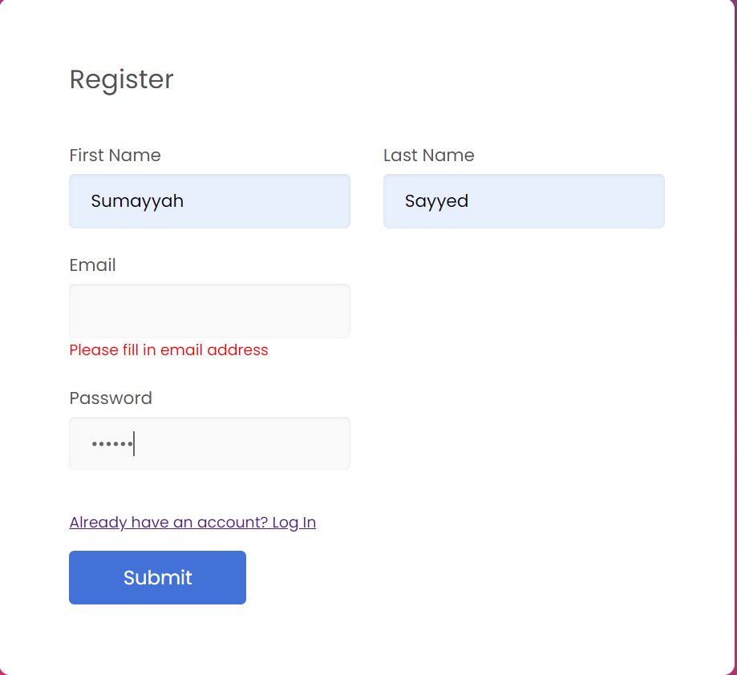
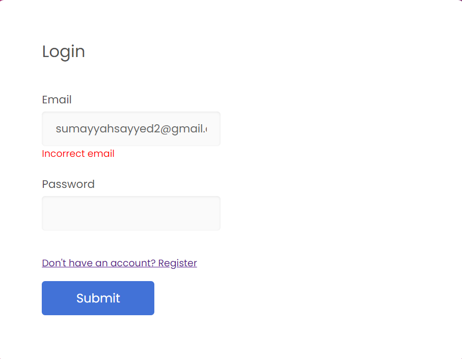
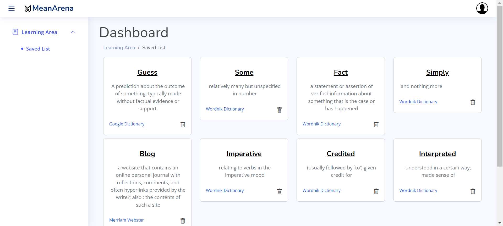

# MeanArena Website

## Table of contents

- [Overview](#overview)
  - [Project](#project)
  - [Screenshot](#screenshot)
- [Process](#process)
  - [Working](#working)
  - [Built with](#built-with)
- [Author](#author)

## Overview

### Project

This project is made in correspondence to our MeanArena Chrome Extension. The website is developed just to create a personalized dictionary for the user to memorize or lookup the words and their definitions.

### Screenshot

## Process

### Working

•	The user enters the main page.
•	Users can Signup to create their accounts.
•	Users can Login to their previously existing accounts.
•	The program can detect wrong input and displays error untill the correct information is passed.
•	On registering the account or logging in, the user has access to the dashboard which will display all the saved words from the chrome extension.
•	Users can delete saved words and their definitions by clicking the bin icon.
•	Users can Sign out from the account.

This website is not a responsive design. Deployment and responsive design of the website is under process. 

### Built with

- Semantic HTML5 markup
- CSS custom properties
- Flexbox
- Javascript
- PHP

## Author

[SumayyahSayyed]
[AyeshaAsif]
[AyeshaUmar]
